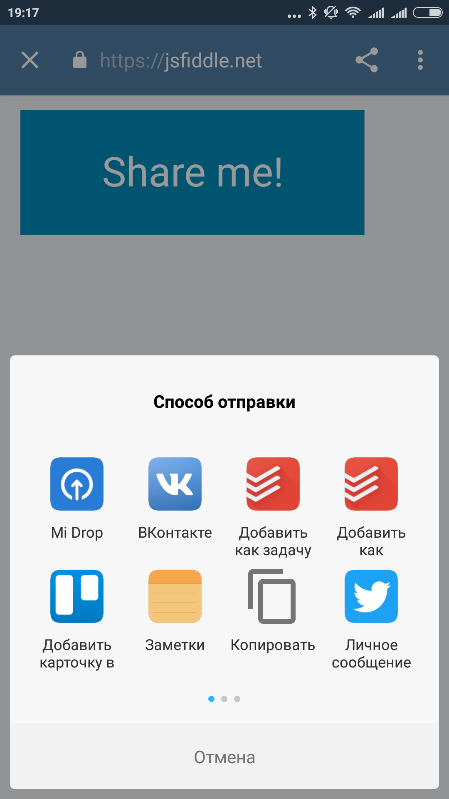

We continue to explore new browser APIs which are slowly begin to spread out. Today's choice is [WebShare API][1]. WebShare API provides a simple yet powerful API to open native sharing popup right out from a web page.

Here is a screenshot:



The source code is really eloquent:

```js
document.getElementById('share').addEventListener('click', () => {
	if (navigator.share) {
        navigator.share({
            title: 'Daily tip #98: WebShare API',
            text: 'Check out the new dailytip - WebShare API!',
            url: 'https://akwuh.me/t/98/',
        })
        .then(() => alert('Successful share'))
        .catch((error) => alert('Error sharing: ' + error));
    } else {
    	alert('Your browser doesn\'t support WebShare API :\(');
    }
});
```

Similar to [PaymentRequest API][2], WebShare API requires a website to be on `https`. Also, `navigator.share` can't be called at any time, but only during [**triggered by user activation task**][3], which basically includes touch/mouse interactions (e.g. `click`).

Unfortunately on my phone WebShare API has an annoying bug: if you click `share` and then close the modal, then all following clicks on `share` will emit `AbortError: Share cancelled`. Also, the feature is supported only by Chrome 61+. So the API is not ready pretty much for production use, but definitely worth checking out in the nearest future.

WebShare API along with [WebShare Target API][4], that specifies the way to make a sharing target from a website, form [Ballista project][5].

[1]: https://developers.google.com/web/updates/2016/09/navigator-share
[2]: https://github.com/jakwuh/dailytip/tree/master/tips/23-10-2017
[3]: https://html.spec.whatwg.org/multipage/interaction.html#triggered-by-user-activation
[4]: https://github.com/mgiuca/web-share-target
[5]: https://github.com/chromium/ballista
