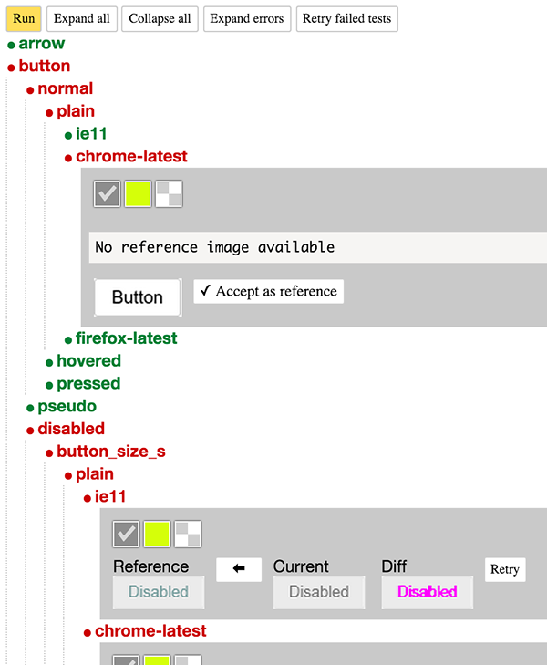

I plan to set up a CI/CD process soon in order to deploy dailytip automatically as soon as I push a new commit to the repository. The most important step of CI as I see is having a good tests coverage.

[`gemini`][1] and [a plenty of other tools][2] provide tooling for regression testing using screenshots. This is a simple, chip and, well, rather reliable way of covering visual contents of a webapp with tests.



Unfortunately, `gemini` works with either `PhantomJS` or `Selenium`. Both of them are not as fast as we wish them to be and both have a slightly intricate setup. It would be much better if we could start our screenshot testing with literally zero-cost:

```bash
npm install chai-puppeteer
```

```js
// spec-bootstrap.js
import chaiPuppeteer from 'chaiPuppeteer';
import chai from 'chai';

chai.use(chaiPuppeteer({
    root: 'screenshots'
}));
```

```js
// suite.js
describe('Tips index', () => {
    it('works', () => {
        return capture({
            url: 'http://localhost:9706/t/',
            selector: 'article'
        });
    });
});
```

As you might guess we are going to implement this using the new [`puppeteer`][3] library from the Chrome DevTools team. Also we will try to run the same suite against both `gemini` and `puppeteer` to see which is faster.

Keep your eyes open!

[1]: https://github.com/gemini-testing/gemini
[2]: https://gist.github.com/cvrebert/adf91e429906a4d746cd
[3]: https://github.com/GoogleChrome/puppeteer/blob/master/docs/api.md#pagescreenshotoptions
